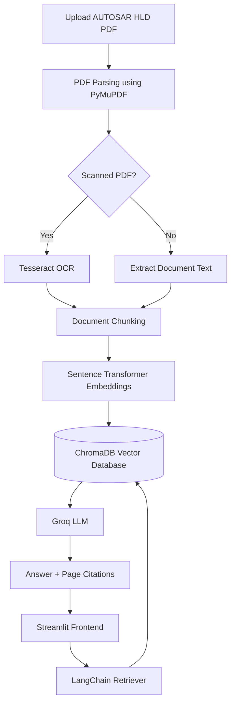

# 🚗 AUTOSAR HLD Document Analysis Assistant

<p align="center">
  <b>An AI-powered engineering assistant for analyzing AUTOSAR High-Level Design (HLD) documents using Retrieval-Augmented Generation (RAG).</b>
</p>

<p align="center">
  Extract Architecture Knowledge • Visualize Dependencies • Functional Workflow Analysis • Engineering Reports
</p>

<p align="center">
  
  
  
  
  
  
  
</p>

---

## 📖 About the Project

The **AUTOSAR HLD Document Analysis Assistant** is an AI-powered document analysis platform designed for automotive software engineers working with **AUTOSAR High-Level Design (HLD)** documents.

AUTOSAR HLDs contain hundreds of pages describing software architecture, communication stacks, Basic Software (BSW) modules, Runtime Environment (RTE), ECU abstraction layers, interfaces, and system workflows. Finding architecture information manually is time-consuming and makes traceability difficult.

This application transforms AUTOSAR HLD PDFs into an intelligent engineering knowledge base using **Retrieval-Augmented Generation (RAG)**. Engineers can upload AUTOSAR HLD documents, ask technical questions with page citations, explore architecture entities, visualize dependencies between modules, extract functional workflows, and generate engineering reports.

---

## ✨ Features

<table>
<tr>
<th width="30%">Feature</th>
<th>Description</th>
</tr>

<tr>
<td>📄 Document Upload</td>
<td>Upload AUTOSAR High-Level Design PDFs for semantic analysis.</td>
</tr>

<tr>
<td>🔍 OCR Support</td>
<td>Automatically extracts text from scanned PDFs using Tesseract OCR fallback.</td>
</tr>

<tr>
<td>🤖 AI Assistant</td>
<td>Ask engineering questions in natural language and receive context-aware answers grounded in the uploaded HLD.</td>
</tr>

<tr>
<td>📍 Source Citations</td>
<td>Every AI response includes page references from the original AUTOSAR document.</td>
</tr>

<tr>
<td>🏗 Architecture Explorer</td>
<td>Extracts Components, Interfaces, Ports, Signals, and Messages from the HLD.</td>
</tr>

<tr>
<td>🕸 Dependency Graph</td>
<td>Visualizes communication relationships between AUTOSAR software modules.</td>
</tr>

<tr>
<td>🔄 Functional Flow Summary</td>
<td>Automatically identifies architectural workflows described in the HLD.</td>
</tr>

<tr>
<td>📑 Engineering Reports</td>
<td>Exports Architecture Summary, Functional Flows, and Extracted Entities in PDF and CSV format.</td>
</tr>

<tr>
<td>🧠 Persistent Knowledge Base</td>
<td>Stores semantic embeddings using ChromaDB for fast document retrieval.</td>
</tr>

</table>

---

## 🏛 System Architecture



---

## 🛠 Tech Stack

<table>
<tr>
<th width="30%">Category</th>
<th>Technology</th>
</tr>

<tr>
<td>Frontend</td>
<td>Streamlit + Custom CSS</td>
</tr>

<tr>
<td>Backend</td>
<td>FastAPI, Uvicorn</td>
</tr>

<tr>
<td>AI Framework</td>
<td>LangChain</td>
</tr>

<tr>
<td>LLM</td>
<td>Groq API (Llama Model)</td>
</tr>

<tr>
<td>Embeddings</td>
<td>BAAI / bge-small-en-v1.5 (Sentence Transformers)</td>
</tr>

<tr>
<td>Vector Database</td>
<td>ChromaDB</td>
</tr>

<tr>
<td>Metadata Database</td>
<td>SQLite</td>
</tr>

<tr>
<td>PDF Processing</td>
<td>PyMuPDF, pdfplumber, Tesseract OCR</td>
</tr>

<tr>
<td>Deployment</td>
<td>Docker & Docker Compose</td>
</tr>

</table>

---

## 📁 Project Structure

```text
AUTOSAR HLD Document Analysis Assistant
│
├── backend/
│   ├── main.py
│   ├── routes/
│   ├── services/
│   ├── models/
│   └── utils/
│
├── frontend/
│   ├── app.py
│   ├── pages/
│   │   ├── 1_Dashboard.py
│   │   ├── 2_Document_Upload.py
│   │   ├── 3_AI_Assistant.py
│   │   ├── 4_Architecture_Explorer.py
│   │   ├── 5_Dependency_Graph.py
│   │   ├── 6_Functional_Flows.py
│   │   ├── 7_Document_Comparison.py
│   │   └── 8_Reports.py
│   │
│   └── components/
│       └── theme.py
│
├── requirements.txt
├── Dockerfile
├── docker-compose.yml
├── .env.example
└── README.md
```

---

## 🚀 Getting Started

### 1. Clone the Repository

```bash
git clone https://github.com/<your-username>/autosar-hld-document-analysis-assistant.git

cd autosar-hld-document-analysis-assistant
```

### 2. Create a Virtual Environment

#### Windows

```bash
python -m venv venv
venv\Scripts\activate
```

#### Linux / macOS

```bash
python3 -m venv venv
source venv/bin/activate
```

### 3. Install Dependencies

```bash
pip install -r requirements.txt
```

### 4. Configure Environment Variables

Create a `.env` file in the project root.

Example:

```env
GROQ_API_KEY=your_groq_api_key
```

> **Note:** Keep `.env` private. Use `.env.example` for GitHub.

### 5. Run the Backend

```bash
uvicorn backend.main:app --reload --port 8000
```

Backend URL:

```text
http://127.0.0.1:8000
```

### 6. Run the Frontend

Open another terminal.

```bash
streamlit run frontend/app.py
```

Frontend URL:

```text
http://localhost:8501
```

---

## 📖 How to Use

<table>
<tr>
<th width="20%">Step</th>
<th>Description</th>
</tr>

<tr>
<td>1️⃣ Upload PDF</td>
<td>Upload an AUTOSAR High-Level Design document from the Document Upload page.</td>
</tr>

<tr>
<td>2️⃣ Automatic Indexing</td>
<td>The backend parses the PDF, performs OCR if required, chunks the document, generates embeddings, and stores them in ChromaDB.</td>
</tr>

<tr>
<td>3️⃣ Explore Architecture</td>
<td>View extracted software components, interfaces, ports, signals, and messages.</td>
</tr>

<tr>
<td>4️⃣ AI Question Answering</td>
<td>Ask engineering questions and receive answers with page citations.</td>
</tr>

<tr>
<td>5️⃣ Dependency Visualization</td>
<td>Inspect relationships between AUTOSAR modules through an interactive graph.</td>
</tr>

<tr>
<td>6️⃣ Export Reports</td>
<td>Generate engineering reports in PDF and CSV format.</td>
</tr>

</table>

---

## 🤖 AI Assistant

The AI Assistant is powered by **Retrieval-Augmented Generation (RAG)** using LangChain and Groq.

### Example Engineering Questions

```text
What are the AUTOSAR software layers?

Explain the Runtime Environment (RTE).

What is Diagnostic Event Manager (DEM)?

Explain CAN Interface.

Which modules communicate through FlexRay?

Summarize the Services Layer.
```

### AI Response Includes

* Context-aware engineering explanation.
* Semantic retrieval from the uploaded HLD.
* Source page citations.
* Structured markdown formatting.

---

## 🏗 Architecture Explorer

Automatically extracts architectural entities from AUTOSAR HLD documents.

### Extracted Categories

| Category   | Examples                                     |
| ---------- | -------------------------------------------- |
| Components | Crypto Service Manager, DEM, EcuM            |
| Interfaces | CAN, LIN, Ethernet, FlexRay                  |
| Ports      | CAN Port, LIN Port, Ethernet Port            |
| Signals    | Communication Signals                        |
| Messages   | CAN Messages, LIN Messages, FlexRay Messages |

This provides a structured inventory of the uploaded architecture document.

---

## 🕸 Dependency Graph

The Dependency Graph visualizes communication and dependency relationships between AUTOSAR modules.

### Visualization Includes

* Basic Software module relationships.
* Communication interfaces.
* Layer interactions.
* Component dependencies.

This provides a high-level architectural overview directly from the uploaded HLD.

---

## 🔄 Functional Flow Summary

The application identifies architectural workflows described inside the AUTOSAR HLD.

### Extracted Workflows

| Workflow                          | Description                                                   |
| --------------------------------- | ------------------------------------------------------------- |
| Microcontroller Abstraction Layer | Hardware-specific driver abstraction.                         |
| ECU Abstraction Layer             | Hardware-independent APIs.                                    |
| Complex Drivers                   | Timing-critical or custom drivers.                            |
| Services Layer                    | Diagnostics, communication, memory, and OS services.          |
| Runtime Environment               | Communication between software components and Basic Software. |

Each workflow includes an AI-generated engineering summary with document references.

---

## 📑 Engineering Reports

Generate structured engineering documentation directly from the uploaded HLD.

### PDF Report

The exported PDF contains:

* Architecture Summary.
* Dependency Summary.
* Functional Workflow Summary.
* Extracted Components.
* Interfaces.
* Architecture Statistics.

### CSV Report

The CSV export contains structured AUTOSAR entities including:

* Components.
* Interfaces.
* Ports.
* Signals.
* Messages.
* Source Pages.

Useful for architecture traceability and documentation review.

---

## 📊 Complete Processing Pipeline

```text
Upload AUTOSAR HLD PDF
          │
          ▼
   PDF Parsing & OCR
          │
          ▼
 Document Chunking Service
          │
          ▼
Generate Sentence Embeddings
          │
          ▼
 Store in ChromaDB
          │
          ▼
   Semantic Retrieval
          │
          ▼
       Groq LLM
          │
          ▼
 AI Assistant • Architecture Explorer
 Dependency Graph • Functional Flows
        PDF / CSV Reports
```

---

## 🎯 Use Cases

* AUTOSAR Architecture Review.
* ECU Software Documentation Analysis.
* Engineering Knowledge Search.
* Architecture Traceability.
* Functional Workflow Understanding.
* AI-assisted Technical Documentation Review.

---

## 🔮 Future Enhancements

* Semantic comparison between multiple AUTOSAR HLD versions.
* Improved page-level traceability for extracted entities.
* Signal-level dependency extraction from architecture diagrams.
* Support for multiple AUTOSAR Classic Platform releases.
* Optional FAISS/Pinecone vector database backend.

---

## 👨‍💻 Author

**Ayush Durukkar**

B.Tech Computer Science Engineering (Core)

MIT World Peace University, Pune

---

<p align="center">
  <b>AUTOSAR HLD Document Analysis Assistant</b><br>
  AI-powered architecture understanding and engineering knowledge retrieval for AUTOSAR software documentation.
</p>
